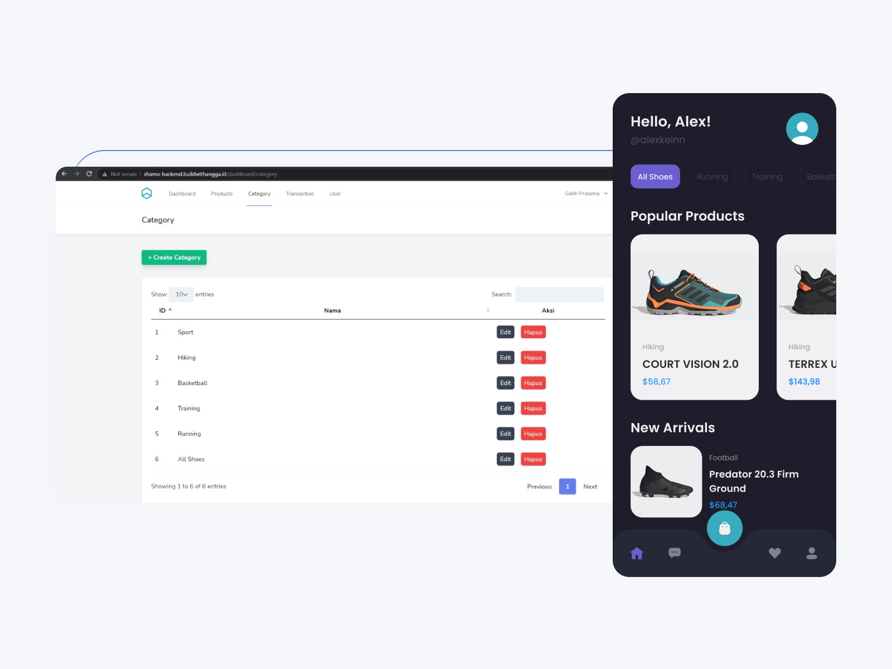

# shamo

Project ini merupakan hasil dan dokumentasi dari course [BWA - Flutter Laravel Shamo](https://buildwithangga.com/kelas/full-stack-laravel-flutter-2021-building-e-commerce-and-chat-apps?main_leads=topic). Shamo merupakan replika dari E-Commerce and Chat Apps.



## Get Started
### Prerequisites

- Pastikan sudah terinstall Flutter SDK pada komputer.
- Pastikan backend-shamo berjalan dengan baik

### Installation

1. **Clone the Project:**
   
   ```bash
   git clone https://github.com/andrirahmanto/shamo.git

2. **Buka direktori project**
   
   ```bash
   cd proyek-flutter

1. **Install package dan run app**
   
   ```bash
   flutter pub get
   flutter run
